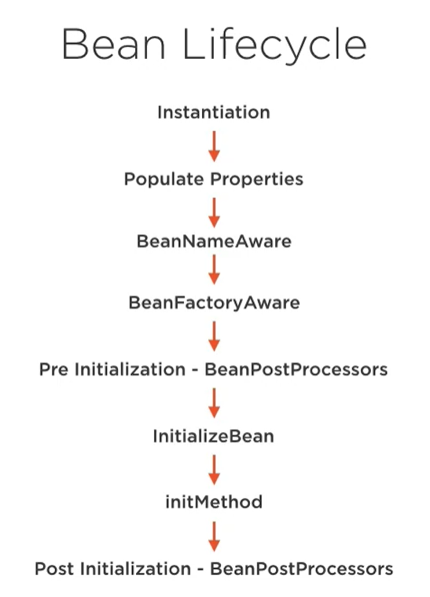

Spring Overview
===============

An overview of the Spring Framework.

---

Spring is a powerful lightweight application development framework.
It is one of the most popular Java based frameworks which is mostly used for enterprise application development.
The main reasons behind its popularity are
* simplicity
* maintainability
* scalability
* testability
* loose coupling

Introduction
------------

Spring is a framework built around reducing the complexities around enterprise Java development without EJBs. 

Dependency injection is simply removing hard-coded wiring in your app and using a framework to inject dependency resources where they are needed.

“convention over configuration” principle

The ApplicationContext is the configured container with all of the dependencies. 

Inversion of Control
--------------------

The basic idea of the *dependency injection* pattern is to have a separate object that injects dependencies with the required behavior, based on an interface contract.

It is said to be an inversion of control pattern since the task of obtaining the implementation or dependency is delegated to another component.
**It is not in control of the dependent how to obtain the dependency.**

The software components that Spring uses to build applications are called **beans**, which are Plain Old Java Objects (POJOs) that are **created, assembled (dependencies are injected), initialized, and managed by the Spring IoC container and located in the Spring application context**.

When the same configuration is used in 90% of the applications written, this makes a good case for favoring *convention over configuration*.
Convention over configuration attempts to decrease the number of decisions that a developer using the framework is required to make without necessarily losing flexibility.

The *DAO (repository) layer* contains classes to retrieve, update, create, and delete entities from the storage support, which usually is some type of database.

The *service layer* is composed of classes doing modifications to the entity objects before being passed on to the repositories for persisting the changes to the storage support (database).
The service layer is the bridge between the web layer and the DAO layer.
It is composed of specialized classes that work together to implement behavior that is not specific to web or data access. 
It is also called the business layer, because most of the application business logic is implemented here.

Typically, for each entity type, a service class also exists, but more complex services can be defined that can use multiple entity types to perform complex tasks.

The Spring IoC container is thus an external authority that passes a dependency to a dependent object that will use it.
Providing dependencies, a process called injection, happens at runtime, when the application is being put together after being compiled, and this allows a lot of flexibility, because the functionality of an application can be extended by modifying an external configuration without a full recompile of the application.


Configuration
-------------

The Java files that have the `@Configuration` annotation replace any XML files that we could've used historically.
It is a class-level annotation.

Mehtods with the `@Bean` annotation are used to get instances of Spring Beans.

```java
@Configuration
public class AppConfig {

    @Bean(name = "customerRepository")
    public CustomerRepository getCustomerRepository() {
        return new HibernateCustomerRepositoryImpl();
    }

}
```

The Bean is registered inside of Spring and available for us to use in the application. 

Configurado de esta manera el Bean es un singleton.
No importa la cantidad de veces que se llame desde nuestra aplicación al método getCustomerRepository, siempre devolverá la misma instancia.
Es decir, el método efectivamente se va a invocar una sola vez.

Scopes
------

There are 5 scopes available to configure a bean.

Valid in any configuration:
* Singleton (default). One instance per Spring container or application context.
* Prototype. Guarantees a unique instance per invocation.

Valid only in web-aware project:
* Request
* Session
* Global

Autowired


Stereotypes annotations
-----------------------

`@ComponentScan` indicates the package that we want to scan for beans to autowire.

* `@Component`
* `@Repository`
* `@Service`
* `@Controller`

XML Configuration
-----------------

XML configuration was the first method of configuration in Spring.

The standard name for the XML configuration file is `applicationContext.xml` and looks like so:

```xml
<?xml version="1.0" encoding="UTF-8"?>
<beans xmlns="http://www.springframework.org/schema/beans"
       xmlns:xsi="http://www.w3.org/2001/XMLSchema-instance"
       xsi:schemaLocation="
        http://www.springframework.org/schema/beans http://www.springframework.org/schema/beans/spring-beans.xsd">

    <!-- bean definitions here -->

</beans>
```

`beans` is a namespace that acts like a dictionary for the properties we can use to create a bean inside our application.

There are 4 types of autowiring
* byType. Uses the default constructor to create the instance and the setters to inject the dependencies. It passes to the setter the bean based on the type. If you have more than one bean of the same type you will get an error.
* byName. Same as above, but passes to the setter the bean that matches its name with the setter name. In this case, you can have multiple beans of the same type, distinguished by name.
* constructor. Uses the constructor with arguments.
* no. There is no automatic dependency injection.

Bean Lifecycle
--------------



FactoryBean
-----------

```java
public class CalendarFactory implements FactoryBean<Calendar> {

	private final Calendar instance = Calendar.getInstance();

	@Override
	public Calendar getObject() throws Exception {
		return instance;
	}

	@Override
	public Class<?> getObjectType() {
		return Calendar.class;
	}
}
```

By having a bean of type `FactoryBean` in the application context we will also have available a bean of the class it generates.
In the example, having a `CalendarFactory` bean we will also have a `Calendar` bean available.

SpEL
----

With Spring Expression Language you can manipulate the object graph and evaluate expressions at runtime.

```java
@Value("#{ T(java.lang.Math).random() * 100 }")
private double seedNum;
```

Proxy
-----

Proxies are used to inject behaviour into the code without modifying the underlying code.

Bean profiles
-------------

It help you adapt to environments.
They allow you to set specific code that gets ran only in a specific environment, so we can swap out configurations at runtime. 

```java
@Profile("dev")
```

VM options:
```
-Dspring.profiles.active=dev
```
