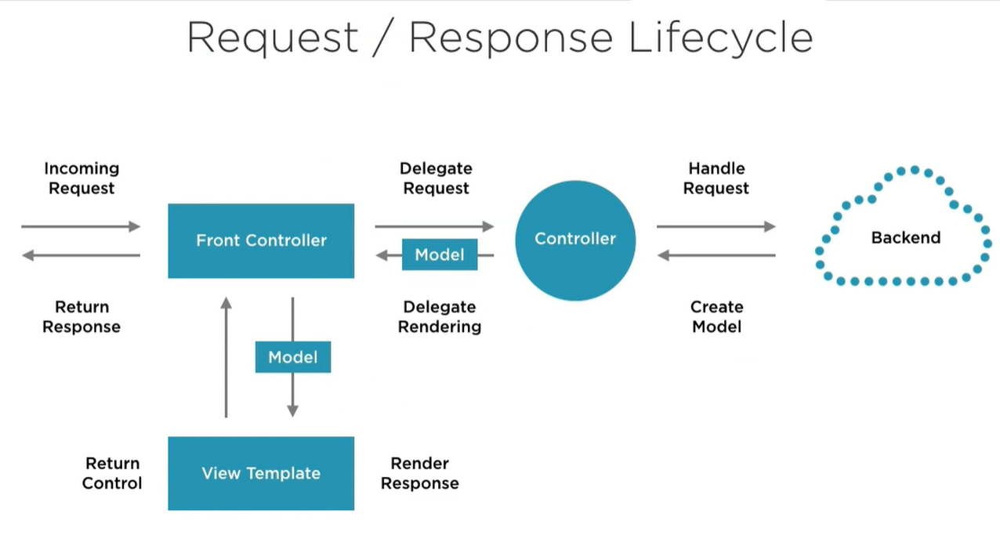

Spring MVC
==========

We have an incoming request that hits our front controller which is the dispatcher servlet inside of Spring. 
It delegate the request over to one of the controllers that we've set up.
So the dispatcher is just a router that known which controller has to handle one request.
The controller handle the request using the backend.
The backend implements the business logic maybe interchanging data with the databases if that's the case and then hands back a model.
The model is basic just our data, what we are trying to represent on our screen.
The rendering is separate from the business logic.
So we have this Model-View-Controller design pattern.

SPA (Single Page Application)

DispatcherServlet: is the entry point of the application.

Controller: uses the command design pattern.

Request Mapping: URL and type (GET, POST, PUT, PATCH, DELETE).

ViewResolver: locates the view to serve (e.g. JSP or HTML page, or RESTful service).

servlet-config. It used to be a `web.xml` file coupled with a `servlet-config.xml` file. 

WAR vs fully self-contained JAR
-------------------------------

Spring Boot
-----------

The great thing about Spring Boot is no need for an external servlet container.
All that is needed reside inside a single runnable JAR file.

JSP
---

Putting the jsp pages underneath `webapp/WEB-INF/jsp/` folder makes it so that they have to be served up internally.
They are not automatically exposed to the browser.
We control the state of how they flow through the application.

